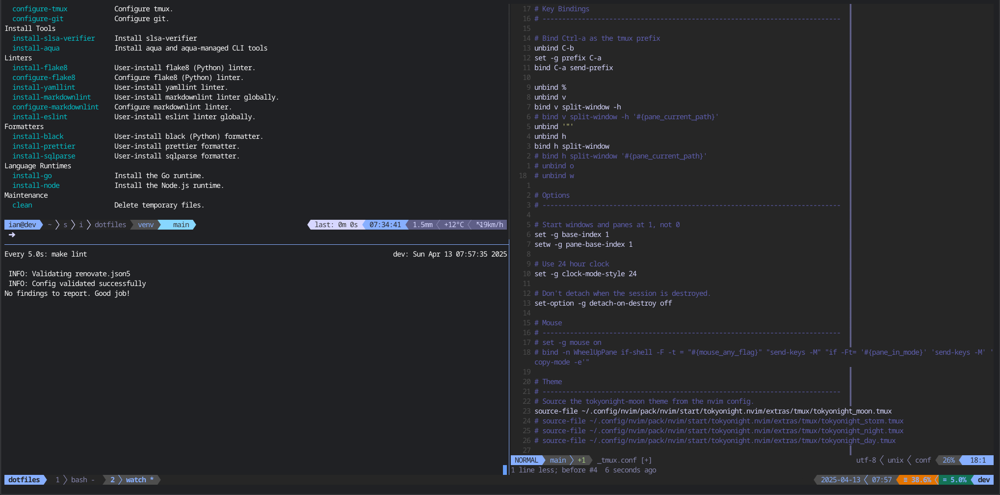

# Ian's dotfiles

[](https://github.com/ianlewis/dotfiles/actions/workflows/pull_request.tests.yml)
[](https://securityscorecards.dev/viewer/?uri=github.com%2Fianlewis%2Fdotfiles)

These dotfiles were originally based on [Armin Ronacher's
dotfiles](https://github.com/mitsuhiko/dotfiles) where the many ideas were
copied shamelessly. Files are symbolically linked from the git checkout into the
home directory which makes it easy to test out configuration.

<table>
  <tr>
    <td>
        
    </td>
    <td>
        
    </td>
   </tr>
</table>

## Features

- Tokyo Night color scheme for Neovim, Tmux, and Bash prompt.
- [Bash](./bash) prompt with git, Python virtualenv, and Nix shell integration.
- [Bash completion](./bash/_bash_completion) with custom completions for various tools.
- [Neovim configuration](./nvim) with LSP support, Treesitter, and many useful plugins.

## Supported Environments

- Linux
    - `amd64`/`x86_64`
    - `arm64`/`aarch64`
- macOS (Darwin)
    - `arm64`/`aarch64` (Apple silicon)

## Requirements

- GNU tools: versions of `make`, `grep`, `awk`, `getopt`, and `mktemp` are
  required.
- `libyaml`: An installation of `libyaml` is also required to install Ruby.
- `xz`: `libzma` should be installed for Python.

On macOS you can install the required packages with
[Homebrew](https://brew.sh/).

```bash
brew install \
    make \
    gawk \
    gnu-getopt \
    grep \
    coreutils \
    bash-completion \
    libyaml \
    xz
```

## Install

Dotfiles are installed using a simple `Makefile` in the root directory.

```shell
$ make
dotfiles Makefile
Usage: make [COMMAND]

  help                      Print all Makefile targets (this message).
Installation
  all                       Run all tests, install and configure everything.
  install                   Install and configure everything.
Testing
  test                      Run all tests.
  unit-test                 Run unit tests.
  e2e-test                  Run end-to-end tests.
  bats-unit                 Run Bats unit tests.
Formatting
  format                    Format all files
  json-format               Format JSON files.
  license-headers           Update license headers.
  lua-format                Format Lua files.
  md-format                 Format Markdown files.
  shfmt                     Format bash files.
  yaml-format               Format YAML files.
Linting
  lint                      Run all linters.
  actionlint                Runs the actionlint linter.
  checkmake                 Runs the checkmake linter.
  commitlint                Run commitlint linter.
  fixme                     Check for outstanding FIXMEs.
  format-check              Check that files are properly formatted.
  markdownlint              Runs the markdownlint linter.
  renovate-config-validator Validate Renovate configuration.
  selene                    Runs the selene (Lua) linter.
  shellcheck                Runs the shellcheck linter.
  textlint                  Runs the textlint linter.
  yamllint                  Runs the yamllint linter.
  zizmor                    Runs the zizmor linter.
Base Tools
  install-bin               Install binary scripts.
  configure-aqua            Configure aqua.
  configure-bash            Configure bash.
  configure-bat             Configure bat.
  configure-crontab         Configure crontab.
  configure-efm-langserver  Configure efm-langserver.
  configure-git             Configure git.
  configure-ghostty         Configure Ghostty.
  configure-nix             Configure nix.
  configure-node            Configure Node.js and npm.
  configure-nvim            Configure neovim.
  configure-tmux            Configure tmux.
Install Tools
  install-slsa-verifier     Install slsa-verifier
  install-aqua              Install aqua and aqua-managed CLI tools
Language Runtimes
  install-go                Install the Go runtime.
  install-node              Install the Node.js environment.
  install-python            Install the Python environment.
  install-ruby              Install the Ruby environment.
Maintenance
  todos                     Print outstanding TODOs.
  clean                     Delete temporary files.
```

Run `make all` to install tools and configuration files.

## Tools

It is necessary to distinguish between tools like linters and formatters used
for linting and formatting files in the `dotfiles` project directory, and those
installed globally for general use.

### Project-local tools

Project-local tools are used to maintain the files in this repository. They are
installed and run in the project directory via the `make lint`, `make format`,
and `make license-header` commands.

### General use tools

Tools like language runtimes, linters, and formatters installed for global use
are installed by `make install-all`. They can also be individually installed by
their appropriate `install-<tool>` command, such as `make install-go` or
`make install-aqua`.

Tools are installed using several methods and are installed in several
locations.

- Tools installed via Python are installed in a Python virtual environment
  managed by `pyenv`. This virtual environment is activated automatically by
  `bashrc`.
- Tools written in JavaScript/TypeScript are installed globally by `npm` into
  the global `node_modules`.
- Pre-compiled binary tools are installed via
  [`Aqua`](https://aquaproj.github.io/) to the `~/.local/share/aquaproj-aqua`
  directory. The `~/.local/share/aquaproj-aqua/bin` directory is added to the
  `$PATH`.

## Language Runtimes

Language runtimes are installed using different methods. Their binaries are
added to the `$PATH`.

### Go

The Go runtime is installed in the `~/opt/go` directory. This is a symbolic link
to the installed Go runtime version. The `~/opt/go/bin` directory is added to
the `$PATH`.

The default `GOBIN` directory of `~/opt/go/bin` is used for installing Go
packages. This directory is added to the `$PATH`.

### Node.js

The Node.js runtime versions are installed and managed by
[`nodenv`](https://github.com/nodenv/nodenv) in the `~/.local/share/nodenv`
directory.

### Python

The Python runtime is installed and managed by
[`pyenv`](https://github.com/pyenv/pyenv) in the `~/.local/share/pyenv`
directory.

### Ruby

The Ruby runtime is installed and managed by
[`rbenv`](https://github.com/rbenv/rbenv) in the `~/.local/share/rbenv`
directory.

## Bash

`.bashrc` and `.bash_profile` scripts are included in the [`bash`](./bash)
directory. Various scripts for different purposes are broken into separate
files, such as `.bash_aliases` and `.bash_completion`.

## Neovim

Neovim configuration is contained in the [`nvim`](./nvim) directory.

## Tmux

Tmux configuration is contained in the [`tmux`](./tmux) directory.

## Compatibility

The scripts here should work on most Linux systems. I have tested them mostly on
Debian-based systems. However, only partial support is provided for NixOS.

These dotfiles have support for macOS (Darwin) on Apple silicon (ARM64).
However, it still has not been tested so some features may still not work.
