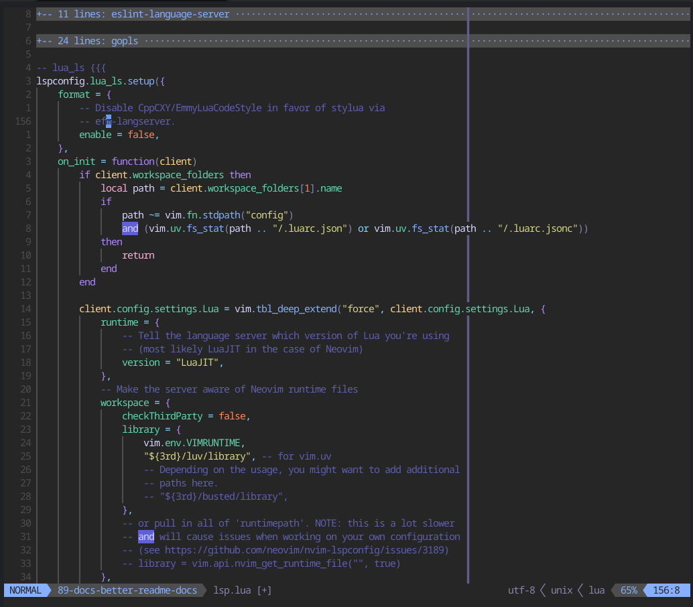

# Neovim Configuration

This directory contains my Neovim configuration. It gets symbolically linked to
`~/.config/nvim`.

## Layout

### `after/plugin`

This directory contains files that configure various plugins.

### `ftplugin`

`ftplugin/` contains files that set file type specific options.

### `lua/ianlewis`

`lua/ianlewis` contains setup for mason packages, global options, filetypes,
colors, key remappings, etc.

### `pack/nvim/start`

`pack/nvim/start` contains git submodules for the various plugins that I use.
These are loaded automatically at startup. The plugins are then configured by
code in `after/plugin`.

## LSP Servers

LSP Servers are installed as
[`mason.nvim`](https://github.com/williamboman/mason.nvim) packages via
[`mason-lspconfig`](https://github.com/williamboman/mason-lspconfig.nvim). This
configures the servers to work with
[`nvim-lspconfig`](https://github.com/neovim/nvim-lspconfig).

- `bash-language-server`
- `efm-langserver`
- `gopls`
- `lua-language-server`
- `python-lsp-server`
- `rust_analyzer`
- `vscode-eslint-language-server`
- `typescript-language-server`
- [`undotree`](https://github.com/mbbill/undotree)
