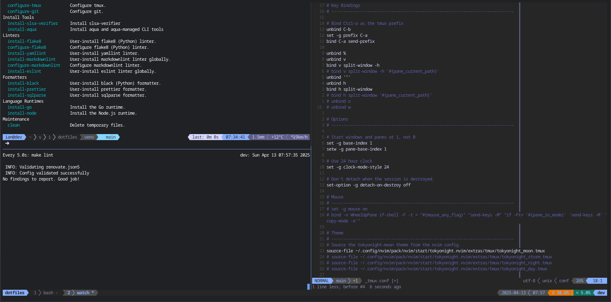

# Tmux Configuration

This directory contains my Tmux configuration. `_tmux.conf` is linked to
`~/.tmux.conf` and `_tmux` is linked to `~/.tmux`.

## Theme

The theme is the [Tokyo
Night](https://github.com/folke/tokyonight.nvim/tree/main/extras/tmux) theme by
folke.

## Plugins

The configuration uses the following plugins:

- [`tpm`](https://github.com/tmux-plugins/tpm): Tmux Plugin Manager.
- [`tmux-sensible`](https://github.com/tmux-plugins/tmux-sensible): A set of
  sensible defaults for tmux.
- [`tmux-cpu`](https://github.com/tmux-plugins/tmux-cpu): CPU and Memory usage
  stats.
